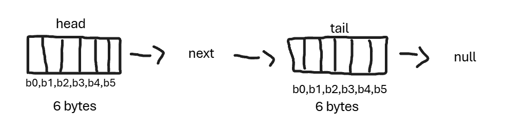
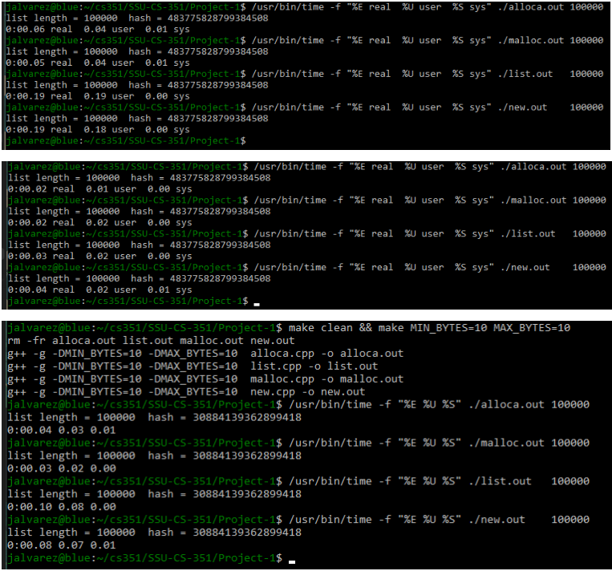
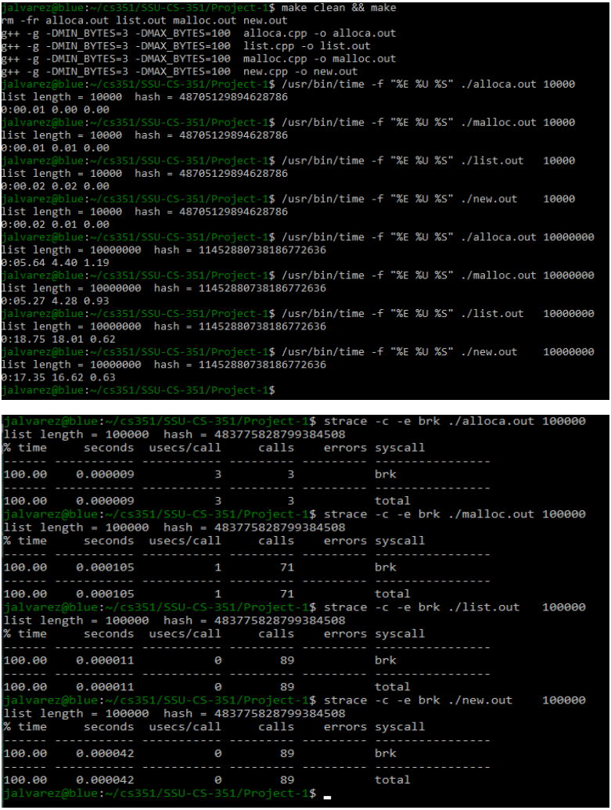

# Project 1: Remote Github Development and Performance Monitoring.

## 1.  Which program is the fastest? Is it always the fastest?
In my case malloc was slightly faster than alloca, by a very small amount. But theoretically alloca should be faster. And both of these were were much faster than new and list 

## 2.  Which program is the slowest? Is it always the slowest?
In all the tests I did list was the slowest with new closely behind. Theoretically yes list will be the slowest because it has more overhead compared to the rest.

## 3, Was there a trend in program execution time based on the size of data in each Node? If so, what, and why?
Yes there seems to be a clear trend in program execution time based on the size of data in each node, and this was true for all programs. The tests with fewer bytes all executed within under .1 seconds however the tests with larger nodes increased by much more., this test was with MIN_BYTES=256 MAX_BYTES=1024 and the programs varied between .5 seconds to 2 seconds with alloca and malloc being faster.

## 4. Was there a trend in program execution time based on the length of the block chain.
Yes there was a trend. As the number of nodes  increased the execution time, the tests with 10k nodes were significantly faster than the tests with 10m nodes. The change in speeds is drastic and almost seems more linear to the amount of nodes.

## 5. Consider heap breaks, what's noticeable? Does increasing the stack size affect the heap? Speculate on any similarities and differences in programs?
What I noticed is that the alloca program had the least amount of brk calls and the other 3 were all fairly similar with my test showing that  list and new were about the same  and malloc having slightly less calls. From what I can find on this I see that increasing the stack size lets alloca handle more nodes but doesn't change the heap behavior. As where the other three are heap based which shows why they have the most calls.

## 6. Considering either the malloc.cpp or alloca.cpp versions of the program, generate a diagram showing two Nodes. Include in the diagram the relationship of the head, tail, and Node next pointers. show the size (in bytes) and structure of a Node that allocated six bytes of data. include the bytes pointer, and indicate using an arrow which byte in the allocated memory it points to.

## 7. There's an overhead to allocating memory, initializing it, and eventually processing (in our case, hashing it). For each program, were any of these tasks the same? Which one(s) were different? 
Alloca is stack based, while malloc, new and list are all heap based.  For all i think initialization and processing are the same and the difference is the allocation method and its overhead.

## 8. As the size of data in a Node increases, does the significance of allocating the node increase or decrease?
I believe that as the size of data in a node increases so does the  significance of allocating.

