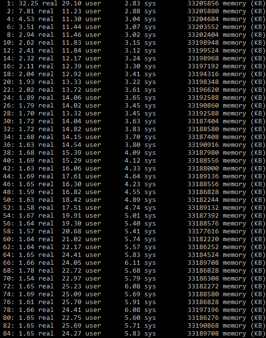

# Project-2 "Threading and multi-core applications"

**Name:** Jovani Alvarez  
**Course:** CS 351  
**Project:** Project-2
#computing a Mean

## Speedup Graph

*(this image shows how the performance scales as the number of threads increased for the mean computation)

## Raw Timing Data

