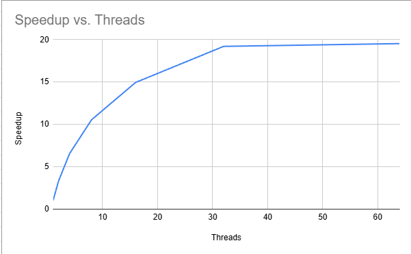
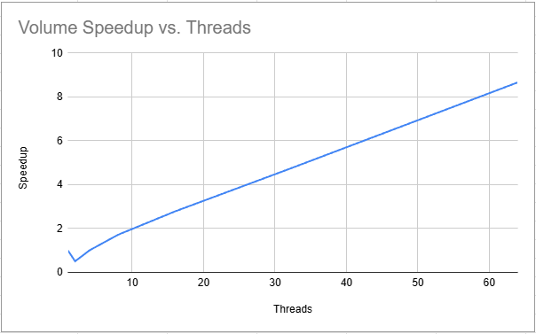
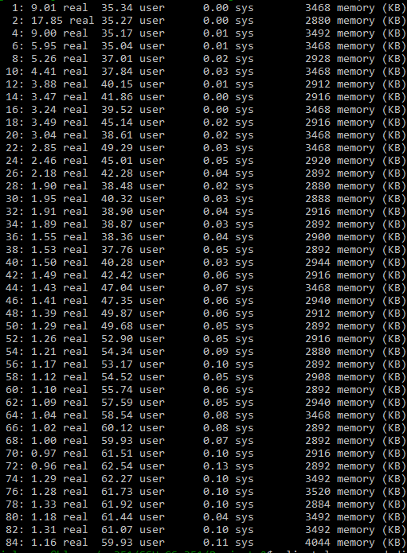

# Project-2 "Threading and multi-core applications"

**Name:** Jovani Alvarez  
**Course:** CS 351  
**Project:** Project-2
#computing a Mean

## Speedup Graph

this image shows how the performance scales as the number of threads increased for the mean computation

## Raw Timing Data

---

## "Computing a Mean" Questions

### **1. For the graph, note the shape of the curve. Does it “converge” to some general value? What’s the maximum speedup you got from threading? What happens when you use more cores than are available in the hardware?**

**Answer:**
The graph rises pretty quickly to begin with but then seems to have diminishing returns as it starts to flatten around ~30 threads. speedup seems to flatten when the number of threads is past the number of physical cores and leads to these diminishing returns. the maximum speedup i got was ~20x  

### **2. Considering the number of cores in the system, do you get a linear scaling of performance as you add more cores?**

**Answer:**
with the tests i ran the performance was not linear. doubling threads does not halve runtimes.

### **3. Looking at your graph, what value would you proposed for p, and describe how you arrived at that value.**

**Answer:**
looking at my graph the max speedup was about 19.5x based on a 1 thread runtime of ~32.25s and 84 thread runtime of ~1.65s. Using Amdahls Law we can calculate that p = ~.949 which means that about 94.9% of the computation is parallelizable.

### **4. Finally, consider the kernel of the mean computation. How many bytes of data are required per iteration? What’s the associated bandwidth used by the kernel? Is that value consistent when you consider threaded versions?**

**Answer:**
each iteration reads on 4 byte float, so the kernel uses 4 bytes per iteration. the bamdwith used by the kernel is  1 GB/s with 1 thread and 20 GB/s with the multiple threads. the value is not consistent across the thread count, effective bandwidth increases with threads untill its saturated at which point adding more threads doesnt improve performance much.

#computing a Volume

## Speedup Graph

this image shows how the performance scales as the number of threads increased for the volume computation

## Raw Timing Data

 
## "Computing a Volume" Questions

### **1. Do you get similar performance curve to threaded.out?**

**Answer:**
No, the performance appears very different compared to the mean computation. in this graph 2 threads was actual;y slower than 1 thread, from then on performanced increased with more threads.

this is because:
- Each thread creates its own **random number generator**, which is expensive.  
- The Monte Carlo kernel has **higher per-iteration cost** (random numbers + sdf calculation).  
- Thread startup and synchronization overhead is significant when the amount of work per thread is small.

